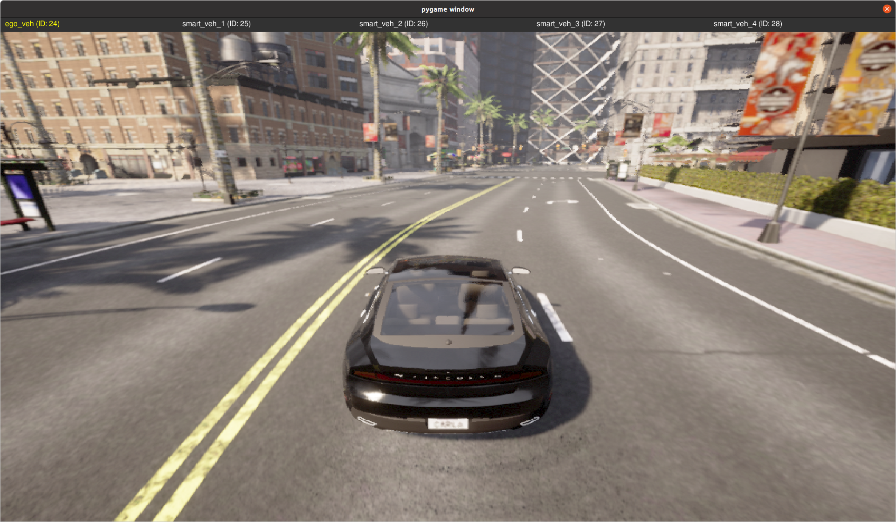
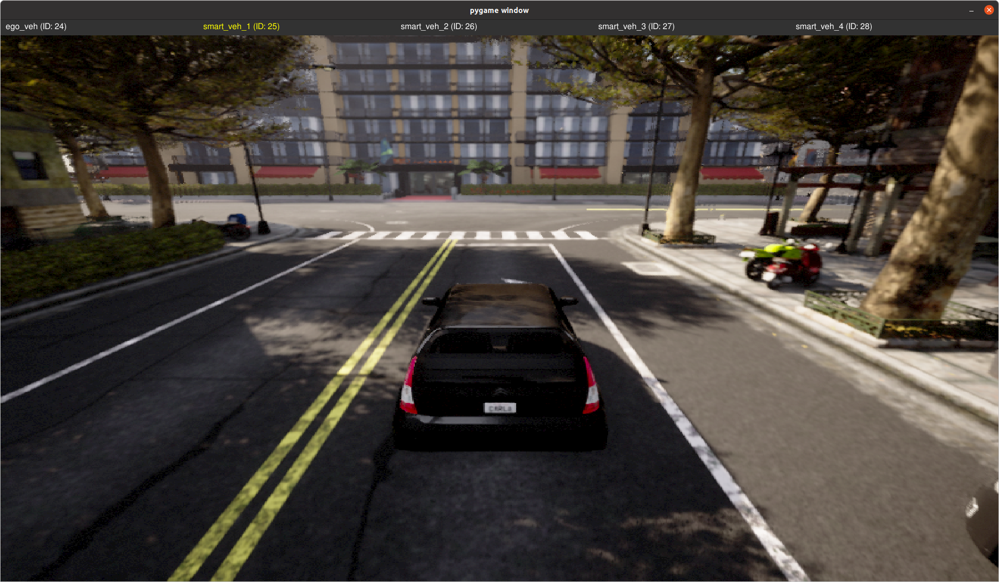
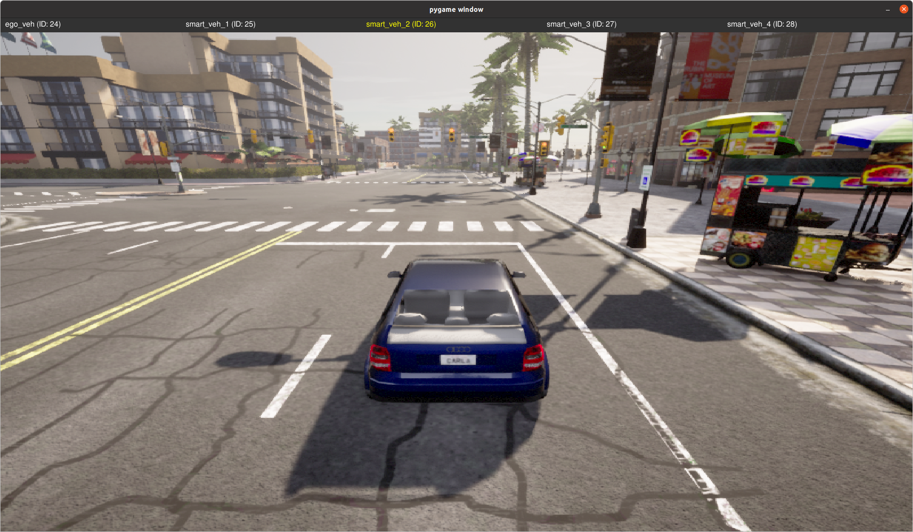
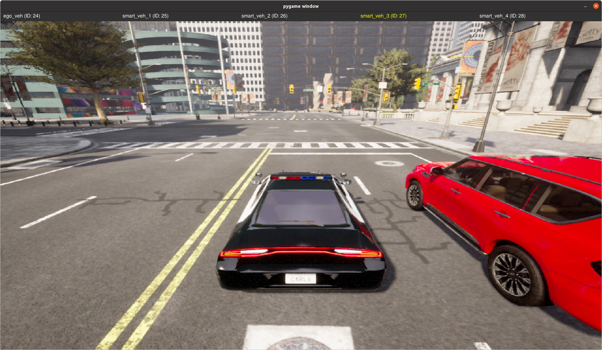
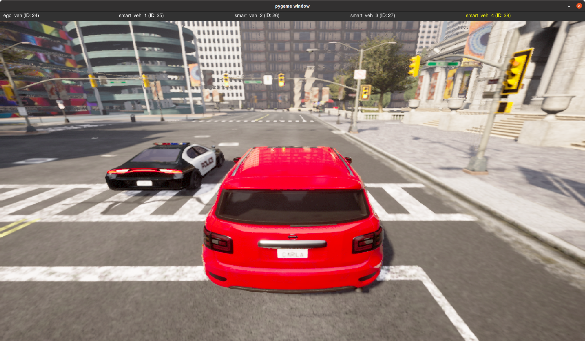

# Collaborative-Vehicle-2-Vehicle-System
Vehicle to vehicle communication systems, for intelligent collaborative driving. 

## Setup

```bash
git clone https://github.com/REGATTE/Collaborative-Vehicle-2-Vehicle-System.git
```

## Simulation

In the first terminal

```bash
cd carla_simulator
source {carla_env}/bin/activate

./CarlaUE4.sh
```

In another terminal, with the venv activated

```bash
cd /path/to/Collaborative-Vehicle-2-Vehicle-System.git
python3 main.py
```

## Visual Results

| Ego Vehicle | Smart Vehicle 1 | Smart Vehicle 2 | Smart Vehicle 3 | Smart Vehicle 4 |
|----------------------|---------------------|---------------------|---------------------|---------------------|
|  |  |  |  |  |

All the vehicles are autonomous and do not follow a custom path waypoint. 

## License

This project is licensed under the [Apache License](LICENSE).

## Collaborators

- [REGATTE](https://github.com/REGATTE)
- [bundle-adjuster](https://github.com/bundle-adjuster)
- [minnakan](https://github.com/minnakan)